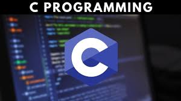

  

<h3 align="center">C Fundamentals</h3>

---

 Praticando fundamentos da linguagem C
      

## 📝 Table of Contents

- [Authors](#authors)
- [Acknowledgments](#acknowledgement)

## ⛏️ Built Using 

- [C](https://learn.microsoft.com/pt-br/cpp/c-language/?view=msvc-170) - Main Language

## ✍️ Authors 
- [@ThiagoKasperSouza](https://github.com/ThiagoKasperSouza) - Idea & Initial work

## 🎉 Acknowledgements 

- [@kylelobo](https://github.com/kylelobo) - Readme template
- [References](./refs.txt)
